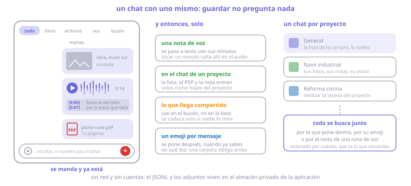
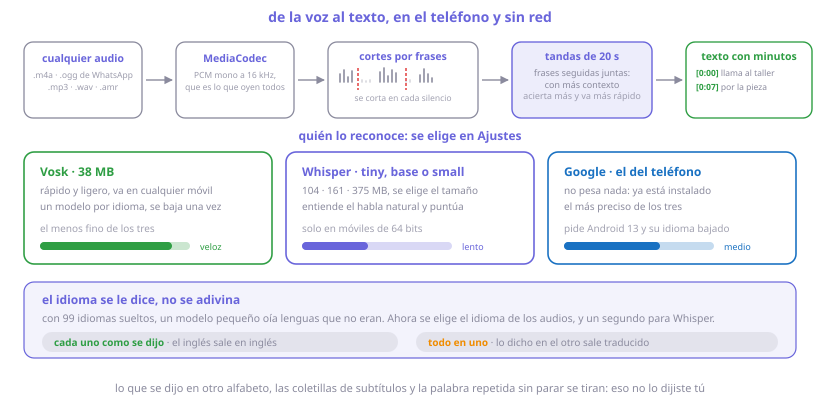
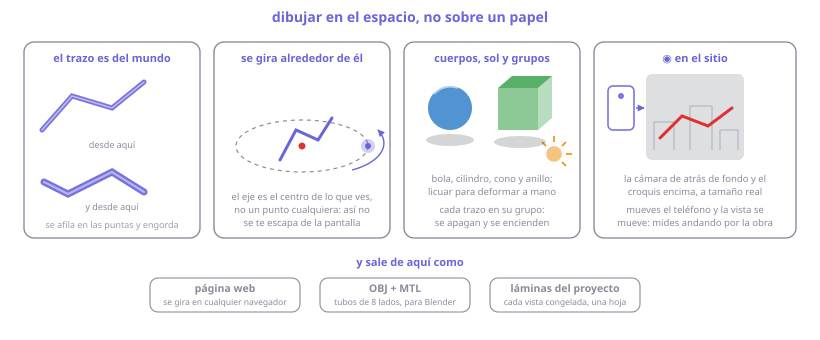
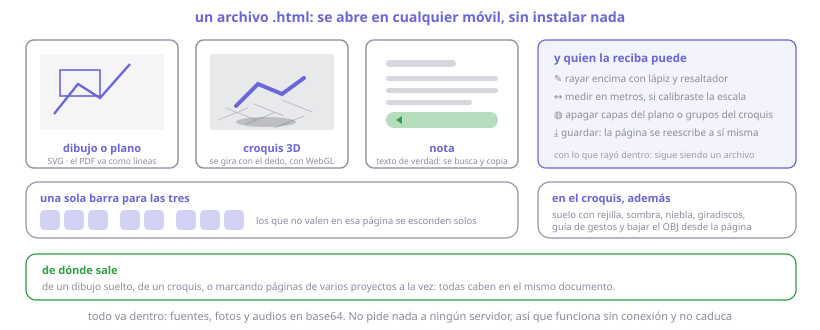

# PixPin Android

Captura, anota y **fija notas flotantes** sobre cualquier app. Y lo que empezó ahí es hoy
también un cuaderno: un chat donde guardar, proyectos con planos, voz que se pasa a texto y
un croquis que se dibuja en el espacio.

**Android 10+** · Kotlin + Compose · 2.196 pruebas · **sin red, sin cuentas, sin analítica**

[**⬇ Descargar el APK**](https://github.com/1xmanMAX/PIXPIN_PRO_ANDROID/releases/latest) · [**Catálogo visual del motor de dibujo**](docs/motor.md)

> Proyecto personal, no oficial. No afiliado a PixPin ni a DepthPixel. Se instala por APK.

---

## Las cuatro cosas que hace

| | |
|---|---|
| **Capturar y anotar** | Recorta la pantalla, dibuja encima y deja el resultado flotando sobre cualquier app |
| **Guardar** | Un chat contigo mismo: fotos, PDF, notas de voz que se transcriben solas |
| **Proyectos** | Un plano en PDF, sus hojas anotadas, sus notas y sus croquis, todo junto |
| **Croquis 3D** | Dibujar en el espacio y girar alrededor de lo dibujado |

Todo funciona **con el avión puesto**. Nada sale del teléfono si tú no lo compartes.

---

## Dónde se dibuja


El mismo dibujo se abre en las cuatro: los elementos son los mismos bytes.

## Capturar


## Pines


## El motor de dibujo

Figuras, lápiz de presión, texto con Markdown, mosaico y foco para tapar, cotas que calculan,
bote con agujeros, alfileres, guías, escala gráfica y transportador.


> Cada herramienta y cada mecanismo, en dibujos: **[docs/motor.md](docs/motor.md)**.

## Gestos y lápiz


Un dedo dibuja, dos encuadran y **nunca dibujan**. El lápiz arranca en el primer contacto, lee
todas las muestras del sistema y la presión; con lápiz a la vista, el dedo pasa a mover el papel.

---

## Guardar: el chat



Un gestor con carpetas obliga a **decidir dónde va cada cosa antes de guardarla**, y esa
decisión es justo la que hace que uno no guarde nada. Una conversación no pregunta: se manda y
ya está, y ordena sola por lo único que uno recuerda de verdad, que es cuándo fue.

| | |
|---|---|
| Secciones | Todo · fotos · archivos · voz · dibujos · fijados · **buzón** |
| Buzón | Lo que llega compartido de otras apps cae aquí, no en la lista, y caduca solo |
| Emoji | Uno por mensaje, se pone después: encontrar sin recordar ni una palabra |
| Comentar | Una frase al lado de un PDF diciendo por qué se guardó |
| Por proyecto | Cada proyecto tiene su chat; lo que entra ahí se une solo a sus hojas |

## La voz



Una nota de voz se pasa a texto en cuanto se guarda, **en el teléfono y sin red**. El texto
queda dentro de la propia nota, con el minuto de cada párrafo: tocarlo salta a ese punto del
audio. En el chat de un proyecto, además, queda como hoja de notas con el audio dentro.

| Motor | Pesa | Cómo va |
|---|---|---|
| **Vosk** | 38 MB | Rápido y en cualquier móvil; el menos fino |
| **Whisper** | 104 · 161 · 375 MB | Entiende el habla natural y puntúa; lento; solo 64 bits |
| **Google** | nada | El más preciso; pide Android 13 y su idioma descargado |

Se elige el **idioma de los audios**, y un segundo para Whisper. Con dos idiomas mezclados hay
dos modos: dejar **cada trozo como se dijo**, o ponerlo **todo en el primero**, traduciendo lo
demás. Lo que suene a otro alfabeto, a coletilla de subtítulos o a palabra repetida sin parar
se descarta: eso no lo dijiste tú.

### Y al revés

| | |
|---|---|
| **Teleprónter** | Eliges un texto —una nota, un `.md`, o lo pegas—, baja solo a la velocidad que pongas y te grabas leyéndolo. Queda como nota de voz **con cada párrafo en su minuto**, sin pasar por ningún reconocedor: se sabe cuándo cruzó cada párrafo la línea de lectura |
| **Pronunciar** | Mantienes pulsado, hablas, sueltas y **te oyes al momento**. Cada toma pisa la anterior; la que convenza se guarda y se transcribe en el idioma que practicas, para ver qué se entendió. Con una guía delante: un texto, una imagen, un PDF página a página o una nota |
| **Conversación** | Varias personas por turnos, un micrófono por cabeza. El texto sale con los nombres, y **se acuerda de quién habló cuándo**: al repetir la transcripción vuelven a salir |

## Proyectos y planos

Un proyecto es un montón de hojas: las páginas de un PDF, lienzos en blanco, notas en Markdown
y croquis 3D. Se marcan las que interesan y **la caja de exportar está arriba, una sola**, aunque
marques hojas de proyectos distintos.

| | |
|---|---|
| **PDF vectorial** | Un plano se lee como geometría, no como foto: nítido a cualquier aumento, sin nada que cargar al acercarse, y con las capas de AutoCAD para encender y apagar |
| **Planos enormes** | Uno mayor que un A0 se trae por trozos, como las teselas de un mapa |
| **Calibrar** | Dos toques sobre una medida conocida y las cotas salen en metros |
| **Salidas** | Página web · PDF de varias hojas · imagen · `.pixpin` editable |

## El croquis en el espacio



Los trazos se quedan **fijos al mundo**: se afilan en las puntas, engordan donde apretaste y
cambian de tono al girar, porque cada uno es un tubo con su lomo y su flanco. Se gira alrededor
del centro de lo que ves, no de un punto cualquiera. Hay bola, cilindro, cono y anillo, licuar
para deformar a mano, sol, grupos y vistas guardadas.

**◉ En el sitio** pone la cámara de atrás de fondo y el croquis encima a tamaño real, con la
lente de verdad del aparato: mueves el teléfono y la vista se mueve con él.

## Compartir: la página web



Todo va dentro del archivo —fuentes, fotos y audios en base64—, así que **se abre sin conexión y
no caduca**. Quien la reciba puede rayar encima, medir, apagar capas y **guardar**: la página se
reescribe a sí misma con lo que rayó, y sigue siendo un solo archivo.

En una página de croquis, el visor trae suelo con rejilla, sombra proyectada, niebla,
giradiscos, guía de gestos y **bajar el OBJ** desde la propia página. Sin traer ni una
biblioteca de fuera: son unos kilobytes de WebGL propio.

---

## Gestos sobre un pin

| | |
|---|---|
| Arrastrar | Mover · sobre la bola, aparcar en burbuja |
| Arrastrar la esquina | Redimensionar (texto, lista, cuentas, tabla) |
| Pellizcar · dos dedos arriba y abajo | Escalar · opacidad |
| Toque · doble toque | Copiar o abrir · minimizar |
| Pulsación larga | Barra: through · dibujar · editar · PDF · pizarra · pegatina · guardar · cerrar |

## Bola flotante

| | |
|---|---|
| Toque · doble toque | Menú · capturar |
| Pulsación larga | Ocultar o mostrar todos los pines |
| Arrastrar | Mover; se imanta al borde |

## Mini-apps: la palabra es el comando

Se copia la palabra, se pinea, y sale la herramienta. Tiene que ir sola.

| Palabras | Qué sale |
|---|---|
| `time` · `timer` · `pomodoro` | Reloj y cuenta atrás (5 · 15 · 30 · 60) |
| `crono` · `cronómetro` · `stopwatch` | Cronómetro con décimas |
| `todo` · `compras` · `tareas` | Lista con casillas |
| `count` · `contador` | Contador |
| `gastos` · `cuentas` · `money` | Libro de cuentas con total |
| `board` · `pizarra` | Pizarra con cuatro fondos y pautas |
| `croquis` · `cad` · `sketch` | Hoja A4 para dibujar acotado |

## Permisos

| Permiso | Para qué | |
|---|---|---|
| Mostrar sobre otras apps | Pines y bola | imprescindible |
| `MediaProjection` | El fotograma que se recorta | imprescindible |
| Micrófono | Notas de voz y transcripción | para la voz |
| Cámara | El modo «en el sitio» del croquis | opcional |
| Notificaciones · batería | Accesos rápidos · que no maten el servicio | recomendado |

---

## Instalar

1. Descarga el APK de la [última versión](https://github.com/1xmanMAX/PIXPIN_PRO_ANDROID/releases/latest).
2. Permite orígenes desconocidos.
3. Concede los permisos de la primera tarjeta y pulsa **Comenzar**.

## Compilar

```bash
export JAVA_HOME="C:/Program Files/Android/Android Studio/jbr"   # JDK 17+

./gradlew assembleRelease      # el APK que se instala a mano
./gradlew testDebugUnitTest    # 2.196 pruebas, en la JVM
./gradlew lintDebug
```

SDK **android-36** + `build-tools 36`. La ruta va en `local.properties`:

```properties
sdk.dir=C\:\\Users\\TU_USUARIO\\AppData\\Local\\Android\\Sdk
```

> El `build.gradle.kts` raíz manda la carpeta de compilación a `pixpin-build`, para poder tener
> el proyecto en una carpeta sincronizada. Si no te hace falta, borra ese bloque.

### Por qué el APK pesa 51 MB

Son **los motores de voz**, no el código. R8 no puede recortar un binario ya compilado:

| | |
|---|---|
| `libonnxruntime.so` (Whisper) | 21,7 MB |
| `libvosk.so` (64 y 32 bits) | 17,2 MB |
| `libsherpa-onnx-jni.so` | 4,8 MB |
| **Todo el código de la app** | **5,8 MB** |

---

## Dentro

```
com.forge.pixpin/
├── motor/      Modelo, geometría, trazo, render, PDF, exportación web   (55.000 líneas)
├── croquis3d/  El espacio: cámara, pluma, cuerpos, OBJ                  (21.000)
├── guardados/  El chat, la voz y sus tres motores                       (10.900)
├── pin/        Ventanas overlay, tipos de pin, almacenes                 (8.100)
├── motormd/    Markdown: bloques, edición viva, tablas, fórmulas         (7.000)
├── ui/         Proyectos, editor de notas, exportar                      (4.100)
├── capture/    MediaProjection, recorte, cosido con scroll               (2.400)
├── mini/       Mini-apps                                                 (2.000)
└── data/ floating/ clipboard/ capa/ annotate/                            (3.100)
```

| Pieza | Qué resuelve |
|---|---|
| `ProjectionSession` · `CaptureFlow` | Un solo `VirtualDisplay` por sesión; entrada única de «quiero capturar» |
| `ScrollMatcher` · `ScrollStitcher` | Deducir el desplazamiento entre fotogramas y coser solo las tiras nuevas |
| `DrawController` · `Renderer` | La máquina de estados del dedo, sin una línea de Android; pintado con caché |
| `Perimetros` · `Regiones` · `Nudos` | El perímetro de cualquier figura; el bote con agujeros; los alfileres |
| `PdfLectura` · `PlanoWeb` | El PDF por dentro; su geometría como líneas, con capas |
| `Transcriptor` · `MotorVosk/Whisper/Google` | Audio a PCM, cortes por frases, tandas, y el motor elegido |
| `Croquis3DEsqueleto` · `Croquis3DPluma` | El esqueleto del trazo, cocido una vez; el tubo con lomo y flanco |
| `Camara3D` · `BaseDeCamara` | La proyección, con lente y ojo de pez; la base congelada por fotograma |
| `ExportarHtml` · `VisorEspacio` | El documento web y su visor 3D, en JavaScript sin dependencias |

La lógica delicada vive en objetos puros para poder probarla sin dispositivo: **2.196 pruebas**
en la JVM. Lo que se ve y se toca solo se valida en un móvil real.

---

## Trece reglas de Android que moldearon el diseño

1. El **consentimiento de captura va antes** del servicio: al revés, `startForeground()` lanza `SecurityException`.
2. Un token de captura sirve para **una sola** `createVirtualDisplay()`.
3. Un espejo de pantalla **solo emite cuando la pantalla cambia**: hay que conservar el último fotograma.
4. El portapapeles **solo se lee con la ventana enfocada** (`onWindowFocusChanged`).
5. El permiso sobre una URI compartida **muere con la actividad**: copiar antes de `finish()`.
6. Las actividades lanzadas desde un overlay necesitan **`taskAffinity` propio**.
7. Compose en una ventana overlay busca los `ViewTree*Owner` **en la vista raíz**.
8. **Atenuar la ventana entera la vuelve intocable**: la transparencia va en el contenido.
9. Arrastrar moviendo la propia ventana **anula los deltas**: hace falta `getRawX/getRawY`.
10. Una ventana `WRAP_CONTENT` **no mide más que la pantalla**: tamaño explícito en píxeles.
11. Cambiar el tamaño de una ventana **no recompone nada** si no cambia un estado leído.
12. Los gestos de Compose **se comen el arranque** del trazo y dan una muestra por fotograma.
13. **No hay API de captura con scroll**: solo queda coser fotogramas.

## Limitaciones

- **Imposibles en Android**: proyectar la ventana viva de otra app, atajos de teclado globales, arrastrar el contenido de un pin a otra app.
- **Contenido protegido** (banca, DRM): sale en negro.
- **Fabricantes agresivos con la batería**: si matan el servicio, los pines desaparecen hasta reabrir.
- Sin **OCR**, sin **QR**, sin **grabación de vídeo**.
- **No se leen DWG, RVT ni DXF**: para medir sobre un plano ajeno se calibra su captura.
- La **captura con scroll** cose fotogramas: con cabeceras fijas o sin textura puede fallar.
- Lo más reciente **está sin verificar en un móvil**: la geometría y los formatos tienen pruebas, el aspecto no.

## Roadmap

| | |
|---|---|
| ✅ 1 – 5 | Captura, pines, lápiz, grupos, scroll, Markdown, mini-apps, visor de PDF |
| ✅ 6 · 6.5 | Croquis acotado · **motor único**: port de Excalidraw, bote, alfileres, capa sobre la pantalla |
| ✅ 7 | Proyectos, planos vectoriales con capas, `.pixpin`, exportación web de todo |
| ✅ 8 | El chat, la voz a texto con tres motores, teleprónter y pronunciar |
| ✅ 9 | El croquis en el espacio, «en el sitio», OBJ y el visor 3D del documento web |
| 10 | **Editar PDFs**: devolver la página anotada al original conservando su texto |
| 11 | OCR y QR · contenido de DOCX/XLSX/PPTX |

**Descartados a propósito**: **leer** DWG (GPLv3, SDK comercial o nube), visor de DXF (un plano
real dio 59 MB y 133.102 entidades), Office con maquetado, **leer** SVG (haría falta un parser:
sería la primera dependencia externa), historial del portapapeles (Android 10+ lo prohíbe en
segundo plano).

> Ojo con el SVG: lo descartado es **leerlo**. Escribirlo no necesita nada, porque el motor ya
> genera las figuras como `M`/`L`/`C`, que es el repertorio exacto de un camino SVG.

---

## Documentación

- [`docs/motor.md`](docs/motor.md) — **catálogo visual**: cada función del motor de dibujo, en dibujos
- [`docs/formato-pixpin.md`](docs/formato-pixpin.md) — el formato `.pixpin` por dentro
- [`docs/superpowers/specs/`](docs/superpowers/specs/) — diseño original y decisiones de cada fase

## Licencia

MIT. Ver [LICENSE](LICENSE). El nombre **PixPin** pertenece a DepthPixel; este proyecto es una
implementación personal e independiente.
