# PixPin Android

Captura, anota y **fija notas flotantes** sobre cualquier app.

**Android 10+** · Kotlin + Compose · 858 pruebas · sin red, sin cuentas, sin analítica

[**⬇ Descargar el APK**](https://github.com/1xmanMAX/PIXPIN_PRO_ANDROID/releases/latest) · [**Catálogo visual completo**](docs/motor.md)

> Proyecto personal, no oficial. No afiliado a PixPin ni a DepthPixel. Se instala por APK.

---

## Dónde se dibuja

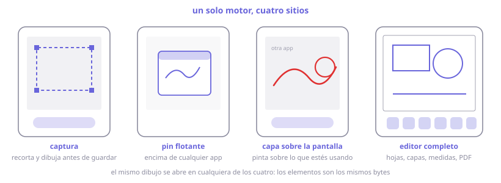

## Capturar

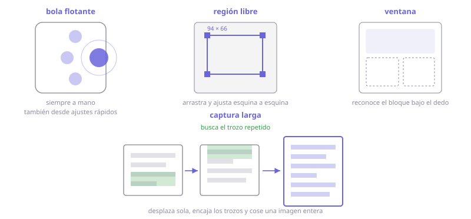

## Pines

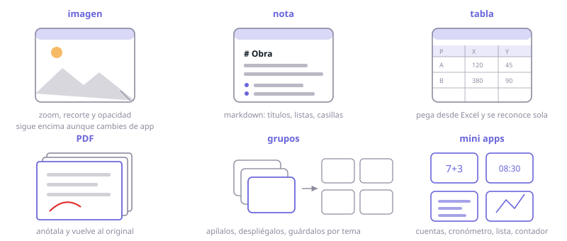

## Dibujar

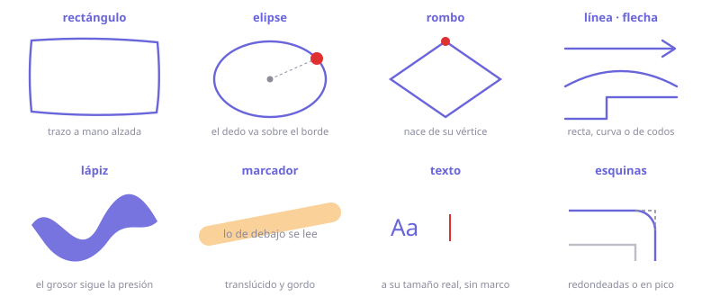

## Tapar y señalar

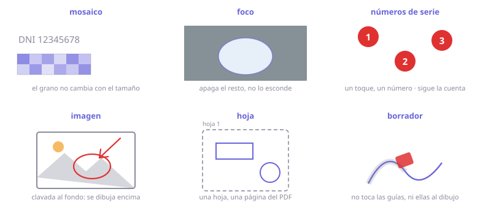

## Medir

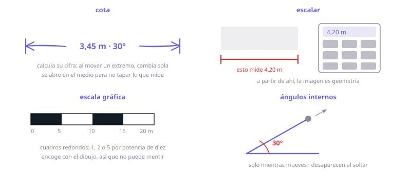

## Construir

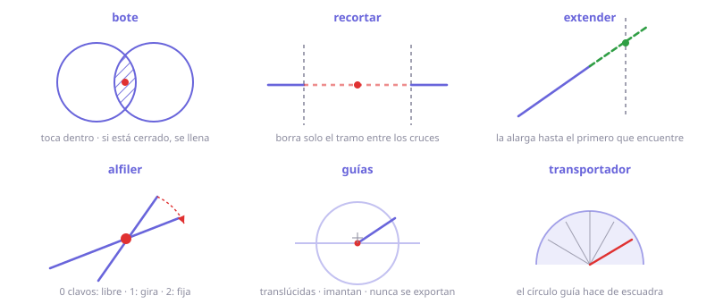

## Lápiz

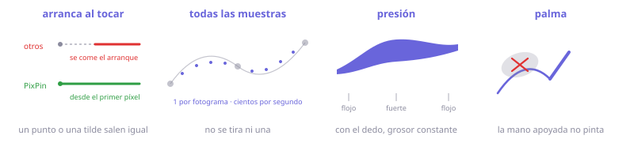

## Gestos

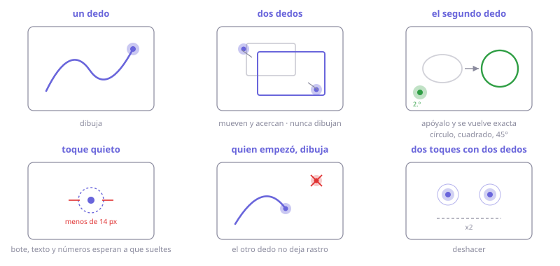

## Salidas

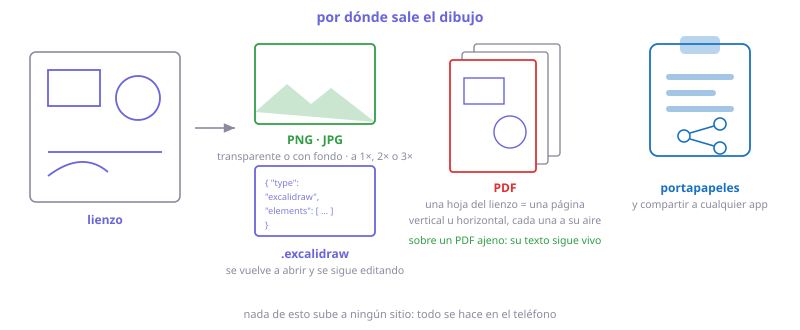

## Ajustes

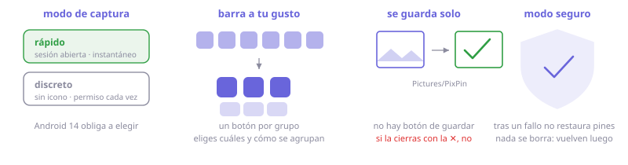

---

## Gestos sobre un pin

| | |
|---|---|
| Arrastrar | Mover |
| Arrastrar sobre la bola | Aparcar en burbuja |
| Arrastrar la esquina (texto, lista, cuentas, tabla) | Redimensionar el cuadro |
| Pellizcar | Escalar |
| Dos dedos arriba/abajo | Opacidad |
| Toque | Copiar · abrir · acción de la mini-app |
| Doble toque | Minimizar / restaurar |
| Pulsación larga | Barra: through · dibujar · editar · PDF · pizarra · pegatina · guardar · cerrar |

## Bola flotante

| | |
|---|---|
| Toque | Menú |
| Doble toque | Capturar |
| Pulsación larga | Ocultar / mostrar todos los pines |
| Arrastrar | Mover; se imanta al borde |

## Mini-apps: la palabra es el comando

Se copia la palabra, se pinea, y sale la herramienta. Tiene que ir sola.

| Palabras | Qué sale |
|---|---|
| `time` · `timer` · `pomodoro` | Reloj y cuenta atrás (5 · 15 · 30 · 60) |
| `crono` · `cronómetro` · `stopwatch` | Cronómetro con décimas |
| `todo` · `compras` · `tareas` | Lista con casillas |
| `count` · `contador` | Contador |
| `gastos` · `cuentas` · `money` | Libro de cuentas con total |
| `board` · `pizarra` | Pizarra con cuatro fondos y pautas |
| `croquis` · `cad` · `sketch` | Hoja A4 para dibujar acotado |

## Permisos

| Permiso | Para qué | |
|---|---|---|
| Mostrar sobre otras apps | Pines y bola | imprescindible |
| `MediaProjection` | El fotograma que se recorta | imprescindible |
| Notificaciones | Accesos rápidos | recomendado |
| Excluir del ahorro de batería | Que no maten el servicio | recomendado |
| Arranque al iniciar | Restaurar pines tras reiniciar | opcional |

---

## Instalar

1. Descarga el APK de la [última versión](https://github.com/1xmanMAX/PIXPIN_PRO_ANDROID/releases/latest).
2. Permite orígenes desconocidos.
3. Concede los permisos del onboarding y pulsa **Comenzar**.

## Compilar

```bash
export JAVA_HOME="C:/Program Files/Android/Android Studio/jbr"   # JDK 17+

./gradlew assembleRelease      # APK pequeño (~4 MB, minificado)
./gradlew assembleDebug        # APK de depuración (~74 MB)
./gradlew testDebugUnitTest    # 858 pruebas
./gradlew lintDebug
```

SDK **android-36** + `build-tools 36`. La ruta va en `local.properties`:

```properties
sdk.dir=C\:\\Users\\TU_USUARIO\\AppData\\Local\\Android\\Sdk
```

> El `build.gradle.kts` raíz manda la carpeta de compilación a `%LOCALAPPDATA%/pixpin-build`,
> para poder tener el proyecto en una carpeta sincronizada. Si no te hace falta, borra ese bloque.

---

## Dentro

```
com.forge.pixpin/
├── capture/    MediaProjection, recorte, cosido con scroll, exportación
├── motor/      Modelo, geometría, trazo, gestos, render, PDF
├── capa/       Dibujar encima de la pantalla
├── annotate/   Lector de trazo del lápiz
├── pin/        Ventanas overlay, tipos de pin, almacenes
├── clipboard/  Portapapeles, clasificación, "compartir con"
├── floating/   Bola, tile, servicio
├── data/       Ajustes, persistencia, informe de fallos
└── ui/theme/
```

| Pieza | Qué resuelve |
|---|---|
| `ProjectionSession` | Un solo `VirtualDisplay` mientras dura la sesión; guarda el último fotograma |
| `CaptureFlow` | Entrada única de «quiero capturar» |
| `ScrollMatcher` · `ScrollStitcher` | Deducir el desplazamiento entre fotogramas y coser solo las tiras nuevas |
| `StrokeTouchReader` · `StrokeSmoothing` | `MotionEvent` crudo: arranque, muestras históricas, presión |
| `OverlayManager` · `PinWindowController` | Un pin = una ventana |
| `PinZoom` · `PinGroups` · `TextBoxSize` | Matemática pura del pellizco, los grupos y el cuadro |
| `Markdown` · `MarkdownEdit` · `TableData` · `MagicWord` | Texto: marcas, edición, tablas, palabras mágicas |
| `DrawController` | La máquina de estados del dedo. Sin una línea de Android |
| `Renderer` | Pintado con caché por elemento y modo noche como filtro |
| `Perimetros` · `Regiones` | El perímetro de cualquier figura; el bote con agujeros |
| `Nudos` · `Recorte` · `Medida` · `EscalaGrafica` | Alfileres, recortar/extender, cotas y escala |
| `PdfLectura` · `PdfLector` | El PDF por dentro, índice comprimido incluido |

La lógica delicada vive en objetos puros para poder probarla sin dispositivo: **858 pruebas**
en la JVM, en menos de un minuto. Lo que se ve y se toca solo se valida en un móvil real.

---

## Trece reglas de Android que moldearon el diseño

1. El **consentimiento de captura va antes** del servicio: al revés, `startForeground()` lanza `SecurityException`.
2. Un token de captura sirve para **una sola** `createVirtualDisplay()`.
3. Un espejo de pantalla **solo emite cuando la pantalla cambia**: hay que conservar el último fotograma.
4. El portapapeles **solo se lee con la ventana enfocada** (`onWindowFocusChanged`).
5. El permiso sobre una URI compartida **muere con la actividad**: copiar antes de `finish()`.
6. Las actividades lanzadas desde un overlay necesitan **`taskAffinity` propio**.
7. Compose en una ventana overlay busca los `ViewTree*Owner` **en la vista raíz**.
8. **Atenuar la ventana entera la vuelve intocable**: la transparencia va en el contenido.
9. Arrastrar moviendo la propia ventana **anula los deltas**: hace falta `getRawX/getRawY`.
10. Una ventana `WRAP_CONTENT` **no mide más que la pantalla**: tamaño explícito en píxeles.
11. Cambiar el tamaño de una ventana **no recompone nada** si no cambia un estado leído.
12. Los gestos de Compose **se comen el arranque** del trazo y dan una muestra por fotograma.
13. **No hay API de captura con scroll**: solo queda coser fotogramas.

---

## Limitaciones

- **Imposibles en Android**: proyectar la ventana viva de otra app, atajos de teclado globales, arrastrar el contenido de un pin a otra app.
- **Contenido protegido** (banca, DRM): sale en negro.
- **Fabricantes agresivos con la batería**: si matan el servicio, los pines desaparecen hasta reabrir.
- Sin **OCR**, sin **QR**, sin **grabación**.
- Lo más reciente del motor está **sin verificar en dispositivo**: la geometría tiene pruebas, el aspecto no.
- **No se leen DWG, RVT ni DXF**: para medir sobre un plano ajeno se calibra su captura.
- La **captura con scroll** cose fotogramas: con cabeceras fijas o sin textura puede fallar.
- El APK de depuración pesa ~74 MB; el de release, **3,7 MB**. Para instalar a mano, el de release.

## Roadmap

| | |
|---|---|
| ✅ 1 · 1.5 | Captura, recorte, anotación, pines, lápiz óptico, zoom |
| ✅ 2 · 3 · 4 | Grupos, captura con scroll, texto redimensionable y Markdown |
| ✅ 5 | Mini-apps, tablas del portapapeles, visor de PDF |
| ✅ 6 | Croquis acotado: metros, imán, cotas que calculan, PDF vectorial |
| ✅ 6.5 | **Motor único**: port de Excalidraw, bote, alfileres, guías, escala gráfica, capa sobre la pantalla |
| 6.9 | **Editar PDFs**: devolver la página anotada al original conservando su texto |
| 7 · 8 · 9 | OCR y QR · vídeo · contenido de DOCX/XLSX/PPTX |

**Descartados a propósito**: **leer** DWG (GPLv3, SDK comercial o nube), visor de DXF
(un plano real dio 59 MB y 133.102 entidades), Office con maquetado, **leer** SVG (haría
falta un parser: sería la primera dependencia externa), historial del portapapeles
(Android 10+ lo prohíbe en segundo plano).

> Ojo con el SVG: lo descartado es **leerlo**. Escribirlo no necesita nada, porque el motor
> ya genera las figuras como `M`/`L`/`C`, que es el repertorio exacto de un camino SVG. Por
> eso exportar sí está hecho y abrir un SVG ajeno sigue sin estarlo.

---

## Documentación

- [`docs/motor.md`](docs/motor.md) — **catálogo visual**: cada función, cada mecanismo, en dibujos
- [`docs/superpowers/specs/`](docs/superpowers/specs/) — diseño original y decisiones de cada fase

## Licencia

MIT. Ver [LICENSE](LICENSE). El nombre **PixPin** pertenece a DepthPixel; este proyecto es
una implementación personal e independiente.
