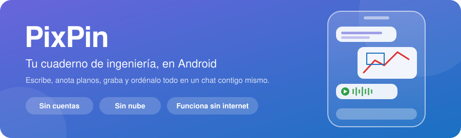
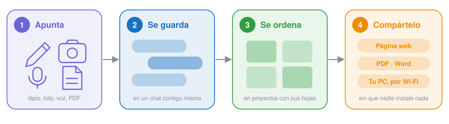
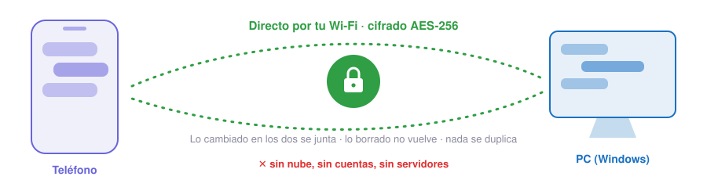
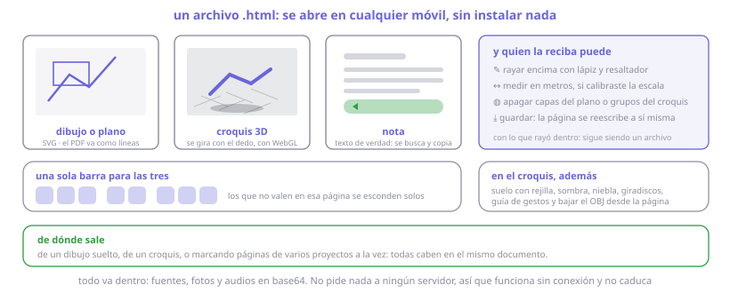
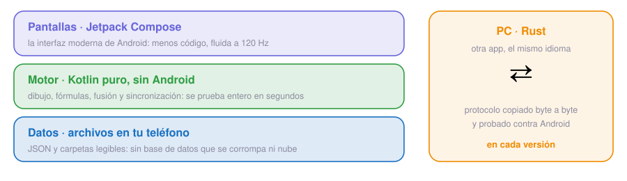

  

  
  
  
  

  <b>Escribe a mano, anota planos, graba la clase y ordénalo todo en un solo sitio.</b> 
  Sin cuentas, sin nube y sin pagar. Lo que haces se queda en tu teléfono.

---

## 🧭 En 30 segundos

1. **Apuntas** lo que sea: un trazo con el lápiz, una foto de la pizarra, un audio o un PDF.
2. **Se guarda en un chat contigo mismo.** No hay que decidir carpetas antes: se manda y listo, como en WhatsApp.
3. **Se ordena en proyectos**, con sus hojas, planos y notas.
4. **Lo compartes** como página web, PDF o Word, o lo pasas a tu PC por Wi-Fi.

> **¿Por qué un chat?** Porque todos sabemos usarlo, y porque una carpeta obliga a decidir dónde va cada cosa *antes* de guardarla, que es justo lo que hace que uno no guarde nada.

<!-- CAPTURA 1: docs/capturas/01-portada.png (el editor con un plano anotado) -->

## ✨ Lo que puedes hacer

| | Qué es | Por qué importa |
|:-:|---|---|
| ✏️ | **Lápiz de verdad**: presión, siete durezas de grafito, figuras perfectas y cotas que miden | Escribir a mano se siente como en papel, y medir sobre un plano no exige otra app |
| 📐 | **Planos en PDF nítidos a cualquier zoom**, con las capas de AutoCAD | Un plano se lee como líneas, no como foto: se amplía sin pixelarse |
| 💬 | **Un chat para guardarlo todo**, y uno por proyecto | Encuentras las cosas por *cuándo* fueron, que es como las recuerdas |
| 🎙️ | **Notas de voz** con micrófono flotante, que se pasan a texto en el teléfono | Grabas encima de cualquier app y la voz nunca sale del aparato |
| 💡 | **Lecciones aprendidas**, con foto y audio, y repaso | Lo que se aprende de un error se olvida en una semana si no se apunta y se repasa |
| 🔎 | **Buscar en PixPin**: una tarjeta que busca solo en tus cosas | Tus apuntes, proyectos y funciones a un toque, sin mezclarse con el resto del teléfono |
| 🧊 | **Croquis 3D, tablas con fórmulas y notas en Markdown** | No todo es un dibujo plano: aquí cabe el modelo, el cálculo y la explicación |
| 📖 | **Lee Word, EPUB, PowerPoint, Excel y PDF** y deja anotarlos | Lo que te mandan se abre y se anota sin salir de PixPin |

<!-- CAPTURAS 2 y 5: docs/capturas/02-lienzo.png · docs/capturas/05-chat.png -->

## 🔄 Tu teléfono y tu PC, siempre iguales

- **Directo por tu Wi-Fi**: los aparatos se hablan entre ellos, sin pasar por internet. Más rápido y nadie más lo ve.
- **Cifrado** con la misma clave en todo el grupo (un código de 10 letras que tecleas una vez).
- **Lo cambiado en los dos se junta**: si escribes en el móvil y en el PC, se quedan las dos cosas. Lo borrado no resucita y nada se duplica.
- **Probado de verdad**: en cada versión, el código real del PC se sincroniza contra el de Android por un socket y se comprueba que todo llega una sola vez.

> **¿Por qué sin nube?** Porque tus apuntes son tuyos. Sin servidor no hay cuenta que hackear, cuota que pagar ni empresa que lea lo que escribes, y funciona con el avión puesto.

## 🌐 Compartir con quien no tiene PixPin

Cualquier dibujo, proyecto, croquis 3D o tabla se exporta como **una página web en un solo archivo**. Se abre en cualquier móvil u ordenador, sin instalar nada y sin conexión, y quien la recibe puede anotar encima y volver a guardarla.

## 🛠️ Cómo está hecho (y por qué)

| Tecnología | Para qué | Por qué esta y no otra |
|---|---|---|
| **Kotlin + Jetpack Compose** | Toda la app | La forma moderna de hacer Android: menos código y pantallas fluidas a 120 Hz |
| **Motor en Kotlin puro** | Dibujo, fórmulas, sincronización | Al no depender de Android se prueba entero en segundos: **2.668 pruebas** en cada cambio |
| **Archivos JSON y carpetas** | Guardar | Legibles, fáciles de copiar y de sincronizar; sin base de datos que se corrompa |
| **AES-GCM + PBKDF2** | Cifrar la sincronización | Criptografía estándar y revisada, no inventada en casa |
| **Whisper y Vosk** (en el teléfono) | Pasar voz a texto | Whisper entiende el habla natural; Vosk va rápido en cualquier móvil. La voz no sale del aparato |
| **Lector de PDF propio** + el de Android | Planos y documentos | Lee el plano como líneas, no como foto: nítido a cualquier zoom y con sus capas |
| **Rust** (app de PC) | PixPin para Windows | Rápida y ligera; habla el mismo protocolo, copiado byte a byte |

## 📲 Instalar en 3 pasos

1. Descarga el APK de la **[última versión](https://github.com/1xmanMAX/PIXPIN_PRO_ANDROID/releases/latest)**.
2. Ábrelo y permite *instalar apps de origen desconocido* (Android lo pide para todo lo que no viene de Play Store).
3. Concede los permisos de la primera pantalla y pulsa **Comenzar**.

Necesitas Android 10 o superior. Los permisos y para qué sirve cada uno están en la [guía](docs/guia.md#permisos).

## 💬 ¿Por qué existe?

Soy estudiante de ingeniería. En el iPad hay apps como GoodNotes o Notability, pero en Android no encontré nada que sirviera para algo más que rayar un PDF. Necesitaba anotar planos, medir, juntar el PDF de clase con la foto de la pizarra y el audio de la explicación, y pasárselo a un compañero **sin obligarle a instalar nada**. Así que la hice, con ayuda de inteligencia artificial.

**Si la pruebas, cuéntame qué te falta o qué se rompe** en las [incidencias](https://github.com/1xmanMAX/PIXPIN_PRO_ANDROID/issues). Me ayuda muchísimo.

---

  📘 <a href="docs/guia.md"><b>Guía completa</b></a> ·
  🎨 <a href="docs/motor.md"><b>El motor de dibujo, en dibujos</b></a> ·
  🔄 <a href="docs/plan-sincronizacion.md"><b>Cómo sincroniza</b></a> ·
  🗂️ <a href="docs/formato-pixpin.md"><b>El formato .pixpin</b></a>

Proyecto personal, no oficial. No afiliado a PixPin ni a DepthPixel.

