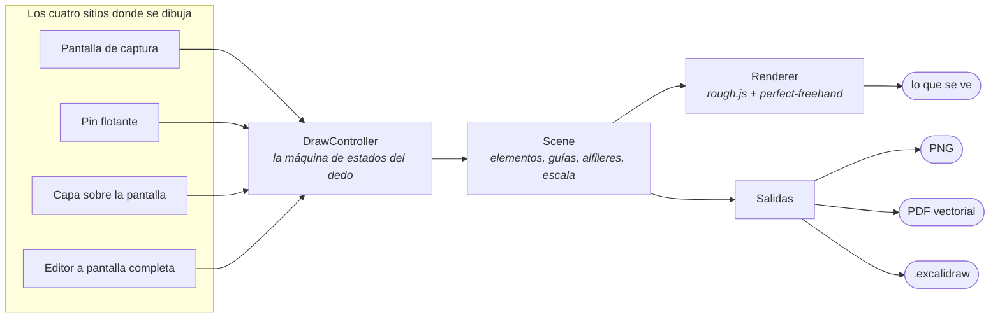
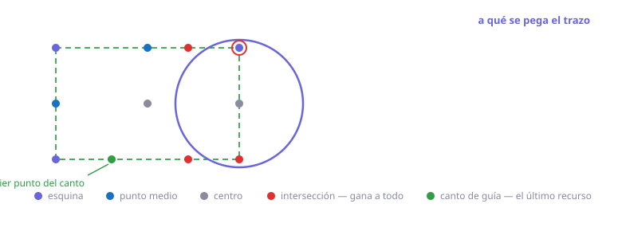
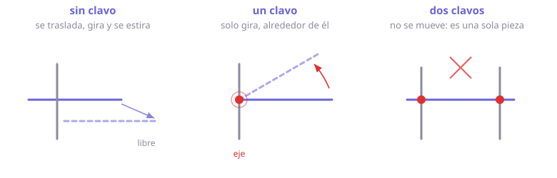
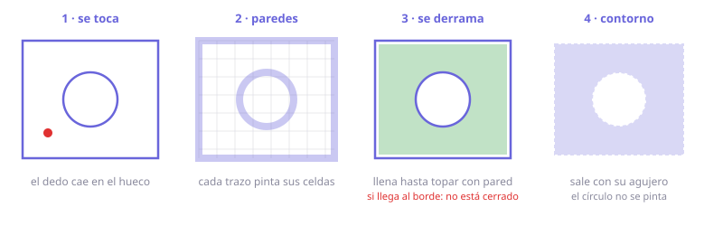
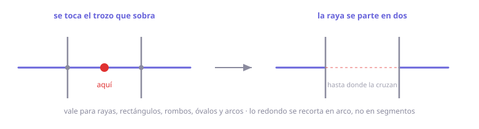
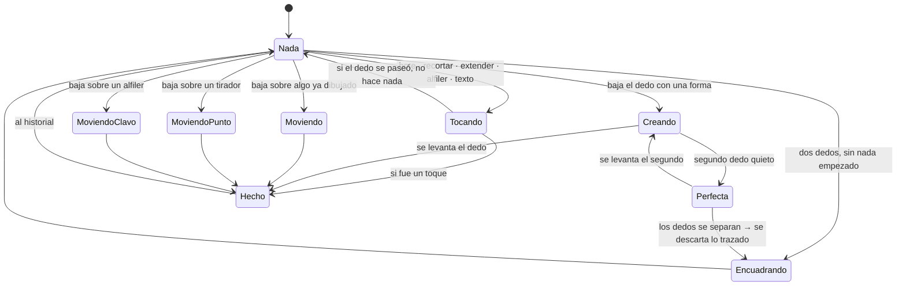
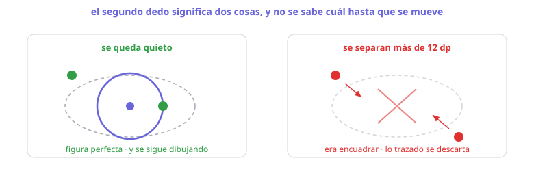
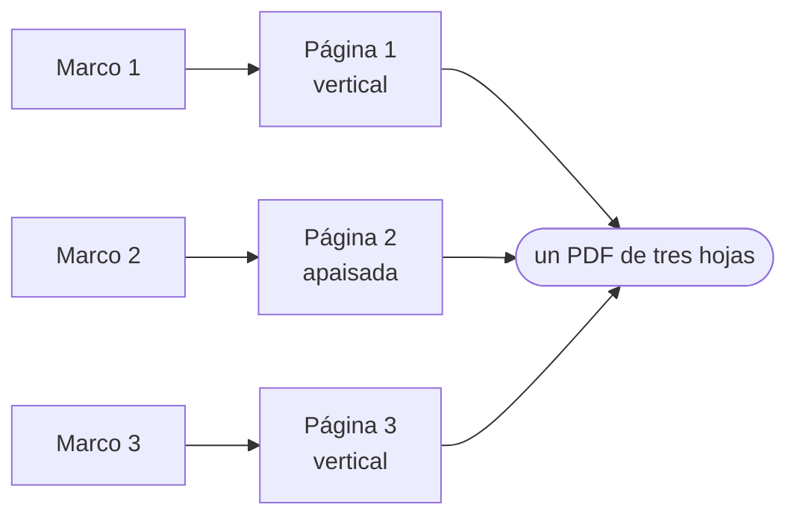
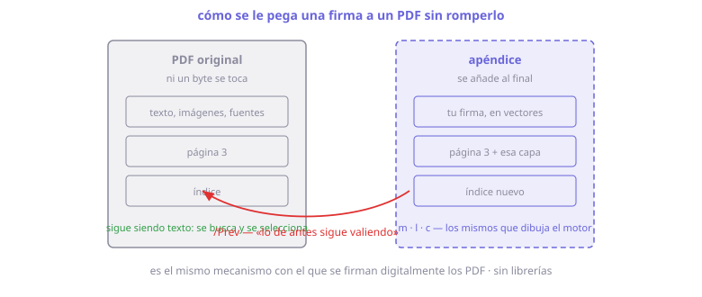

# El motor de edición

Todo lo que se dibuja en PixPin —sobre una captura, dentro de un pin flotante, encima de
la pantalla o en el editor a pantalla completa— pasa por el mismo sitio:
`com.forge.pixpin.motor`.

No siempre fue así. Hubo **tres** motores conviviendo: `annotate` para las capturas,
`croquis` para medir y la barra del pin por su cuenta. Cada arreglo había que hacerlo tres
veces, lo aprendido en un sitio no valía en el otro, y no se podía acotar encima de un
dibujo ni dibujar encima de un plano. Este módulo los sustituye a los tres.

Es un **port de [Excalidraw](https://github.com/excalidraw/excalidraw)** —su modelo, su
trazo a mano alzada y su formato de archivo— más las herramientas que hacían falta aquí y
que el original no tiene.

---

## Índice

- [La frontera](#la-frontera)
- [El modelo](#el-modelo)
- [El trazo a mano alzada](#el-trazo-a-mano-alzada)
- [Las herramientas](#las-herramientas)
- [Los mecanismos](#los-mecanismos)
  - [El imán](#el-imán)
  - [Las guías](#las-guías)
  - [El alfiler](#el-alfiler)
  - [El bote de relleno](#el-bote-de-relleno)
  - [Recortar y extender](#recortar-y-extender)
  - [Medir](#medir)
- [La máquina de estados del dedo](#la-máquina-de-estados-del-dedo)
- [Salidas](#salidas)
- [PDF](#pdf)
- [Cómo se prueba](#cómo-se-prueba)

---

## La frontera

Dos reglas, y las dos las vigila `MotorSeparadoTest` leyendo los archivos, porque nada en
el lenguaje impide saltárselas:

1. **El motor no depende de la aplicación.** Ningún archivo puede importar `pixpin.pin`,
   `pixpin.capture` ni lo que fueron `croquis` y `annotate`. La única excepción reconocida
   es `ImageStore`: guardar imágenes es del almacén de la app y duplicarlo no arreglaría
   nada.
2. **Su núcleo no toca Android.** Solo la capa de arriba —la que tiene que hablar con el
   sistema— puede importar `android.*` o `androidx.*`:
   `Renderer`, `DrawCanvas`, `DrawToolbar`, `DrawEditorActivity`, `DrawExport`, `DrawPdf`,
   `DrawTablas`, `DrawFonts`, `Theme` y `ExcalidrawStore`.

La segunda regla es la que sostiene todo lo demás: la geometría, el trazo y la máquina de
estados del dedo se comprueban **sin dispositivo**. Es como se encontró el rizo de las
esquinas redondeadas y como se prueba el lápiz.

---

## El modelo

`Element` es una **clase plana con discriminante**, no una jerarquía sellada. Va contra la
costumbre y es a propósito: el JSON de `.excalidraw` es exactamente esa forma —un objeto
con `type` y todos los campos al mismo nivel— así que serializa y deserializa sin capa de
traducción. Una jerarquía obligaría a mantener el mapeo a mano en los dos sentidos, que es
justo donde se cuelan los fallos de interoperabilidad.

De Excalidraw: `rectangle`, `diamond`, `ellipse`, `arrow`, `line`, `freedraw`, `text`,
`image`, `frame`.

Propios de PixPin, con el prefijo `pixpin-` en su nombre serializado para no chocar nunca
con un tipo que el original añada:

| Tipo | Qué es |
|---|---|
| `pixpin-mosaic` | Tapa lo que hay debajo, pixelado o desenfocado |
| `pixpin-spotlight` | Oscurece todo menos su caja |
| `pixpin-serial` | Un círculo con un número dentro: 1, 2, 3… |
| `pixpin-measure` | La cota: una raya que **calcula** su cifra |
| `pixpin-arc` | Un trozo de circunferencia, guardado como óvalo + barrido |
| `pixpin-region` | El relleno de un hueco que no es de ninguna figura |
| `pixpin-scalebar` | La escala gráfica a cuadros de los planos |

Dos campos merecen atención:

- **`seed`** es el más importante del modelo. El trazo a mano se genera con ruido; sin
  guardar la semilla, cada redibujado sortea otro ruido y la forma tiembla al mover el
  dedo o al hacer zoom.
- **`reference`** marca lo que es andamio y no dibujo. Va como una marca en el elemento y
  no como un tipo aparte para que **cualquier** herramienta pueda trazar guía sin duplicar
  nada.

---

## El trazo a mano alzada

Tres piezas portadas línea por línea, porque **el orden de las llamadas al generador
aleatorio es parte del resultado**: una llamada de más o hecha en otro orden cambia el
dibujo entero aunque la semilla sea la misma.

- **`Rough`** — port de rough.js. No dibuja la línea pedida: la dibuja dos veces, cada una
  con los extremos desplazados por ruido y con una curva de Bézier en vez de una recta.
- **`Freehand`** — port de perfect-freehand. El lápiz no es una línea recorrida con un
  pincel: es el **contorno relleno** de una mancha, que es lo que da los extremos afilados
  y el ancho que fluye con la velocidad.
- **`Shapes`** — de qué puntos se compone cada figura, aparte del renderizador y sin una
  línea de Android, porque aquí es donde un cuadrado sale cuadrado o sale deforme.

El **modo noche es un filtro de pintado, no un cambio en los datos**. Los colores que van
al archivo son siempre los del modo día; si no, cambiar de modo reescribiría el dibujo y
exportarlo daría un resultado distinto según cómo lo estuvieras mirando.

`Renderer` cachea la geometría por elemento. La entrada se invalida comparando **los campos
que afectan al dibujo**, no `version`: mientras se arrastra para crear una forma la caja
cambia sin tocar la versión, así que fiarse de ella dejaría el trazo congelado en el primer
fotograma. Esa huella incluye `arcStart` y `arcSweep`, y olvidarlos fue justo lo que dejaba
el transportador dibujando un pellizco de arco y nada más.

---

## Las herramientas

| Grupo | Herramientas |
|---|---|
| Mover | Selección · Lazo · Mano |
| Pintar | Lápiz · Marcador · **Bote de relleno** |
| Formas | Rectángulo · Elipse · Rombo |
| Rayas | Flecha · Línea |
| Arreglar | **Recortar** · **Extender** · **Alfiler** |
| Escribir | Texto · Números de serie |
| Tapar | Mosaico · Foco |
| Medir | Cota · Escalar · **Escala gráfica** |
| Hoja | Marco · Imagen |
| Borrar | Borrador |

**La herramienta elegida se queda puesta** hasta que la cambies. Excalidraw vuelve a la
flecha tras cada forma porque en escritorio se retoma con una tecla; con el dedo eso obliga
a volver a la barra entre cuadrado y cuadrado.

La barra enseña **un botón por grupo** —la herramienta que tengas puesta de ese grupo— y al
volver a tocarlo se despliegan sus hermanas: veintitantas herramientas en una barra de seis
botones sin esconder nada a más de dos toques. El reparto lo decide el usuario arrastrando
en los ajustes, y hay uno por sitio: **el pin**, **la capa sobre la pantalla** y **el editor
avanzado** tienen listas y grupos independientes.

`Barra.kt` es lógica pura y comprobable porque lo que se puede romper ahí no es que se vea
mal: es que una herramienta **desaparezca de la barra** y no haya forma de llegar a ella.

---

## Los mecanismos

### El imán

Con el dedo es imposible acertar la esquina exacta de un rectángulo. El imán la perdona:
cuando el dedo pasa cerca de un punto notable, lo que estás dibujando se pega a él.

| Anclaje | Qué es |
|---|---|
| `ESQUINA` · `MEDIO` · `CENTRO` · `EXTREMO` | Los puntos notables de una figura |
| `EJE` | El origen de coordenadas y sus dos rectas |
| `INTERSECCION` | Donde se cruzan **dos figuras cualesquiera**, o una consigo misma |
| `BORDE` | Todo el canto de una guía: la escuadra |

La intersección gana a todo: es la más difícil de acertar a pulso —no existe como vértice
de nada— y por tanto la que más se agradece. El borde es lo contrario, **el último
recurso**: pasa por encima de los vértices de su propia figura, así que si compitiera por
distancia la esquina no ganaría jamás.

`Perimetros.kt` es lo que permite cruzar cualquier cosa con cualquier cosa: reduce **todos**
los tipos a tramos rectos con un `when` exhaustivo, así que el compilador no deja añadir un
tipo y olvidarse. Antes solo se cruzaban las figuras hechas de rectas — justo las que menos
falta hace, porque tienen vértices cerca.

### Las guías

El lápiz azul de los planos de toda la vida: se traza el andamio, se dibuja encima
apoyándose en él y al final se borra el azul.

- Se ven translúcidas, y **cualquier herramienta** puede trazarlas: es un interruptor, no
  una lista de herramientas paralela.
- **El modo guía separa dos mundos.** Dentro se selecciona, se mueve y se borra el andamio;
  fuera, el dibujo — y ninguna guía se puede borrar por accidente. El andamio está para
  pasarle el lápiz por encima, así que el borrador pasa por él todo el rato.
- **La escuadra**: el trazo se pega a todo el canto de una guía, no solo a sus vértices. Es
  lo que permite *recorrerla*; entre esquina y esquina no hay ningún punto al que pegarse.
- **El transportador**: repasar con la elipse el borde de un óvalo guía dibuja el arco que
  repasas, con el imán puesto en el final.
- Las guías redondas llevan una **cruz en su centro**: es el único punto notable de un
  círculo que no está dibujado en ninguna parte.

**No hay botón de borrarlas todas.** Lo hubo y se quitó: un solo toque que se lleva el
andamio entero es de los que solo se pulsan por error.

### El alfiler

Un clavo que atraviesa dos figuras. La analogía es literal y de ella sale todo el
comportamiento:

| Clavos en una figura | Qué puede hacer |
|---|---|
| 0 | Todo: se traslada, gira sobre su centro, se estira |
| 1 | **Solo girar**, y alrededor del clavo |
| 2 o más | Nada: dos puntos fijos la fijan entera |

Lo importante es que **la traslación desaparece con el primer clavo**. Un listón clavado no
se puede llevar a otro sitio: se puede girar y ya. Para mover lo que está clavado se mueve
**el clavo**, que es lo que se hace en la realidad — se arranca y se vuelve a clavar; y si
la pieza tiene otro clavo, gira sobre ese, como una manivela.

Se clava **en el cruce de verdad**: el punto se afina con el mismo imán, porque clavarlo
«casi» en la intersección uniría las figuras por un punto que no está en ninguna de las dos.
Donde hay clavo **no se pinta el tirador blanco**: un punto, una ley.

Cómo se agarra a cada figura importa más de lo que parece, y costó tres intentos:

1. *Proporción de su caja* — falla, porque la caja de una raya horizontal no tiene alto.
2. *Distancia al origen del elemento* — falla, porque el origen de una raya **es su primer
   punto** y se recalcula al mover una punta. Eran los estirones infinitos.
3. **Fracción del recorrido** — «a un tercio de la raya» sigue significando lo mismo la
   estires, la gires o le muevas una punta. Es la buena.

### El bote de relleno

Rellena **el hueco que dejan varias figuras**, que no es de ninguna de ellas. Hasta ahora
solo se podía colorear lo que alguien hubiera dibujado de una tacada.

Se hace **por rejilla y no por geometría**: se pintan las paredes en una rejilla y se
derrama desde el punto tocado. La respuesta de libro —construir el grafo de intersecciones
y buscar la cara mínima— es exacta y es una fuente inagotable de casos degenerados: tres
líneas que se cortan en el mismo punto, una tangente, un garabato con doscientos cruces
consigo mismo. En un motor a mano alzada eso es lo **normal**.

Y la pérdida de precisión **es justo la tolerancia que hace falta**: un hueco más estrecho
que una celda se da por cerrado. Dibujando con el dedo, dos trazos que «se tocan» casi
nunca se tocan de verdad.

- Si el derrame llega al borde de la zona de trabajo, **no se rellena nada y se avisa**:
  quiere decir que el espacio está abierto. Pintar «lo que se pueda» teñiría media escena.
- Sale con sus **agujeros**: el hueco entre un cuadrado y un círculo de dentro es un anillo.
- Cuatro rellenos: rayas, cruces, **líneas** (a tiralíneas, sin temblor — para la sección de
  un plano) y sólido.
- Un relleno **no hace de pared**. Lo hizo, y el bote empeoraba a cada uso: cada mancha
  dejaba una pared nueva un pelo desplazada de las de verdad.
- El bote respeta el mundo activo: en modo guía encierran las guías, fuera el dibujo.

### Recortar y extender

Las dos operaciones de un plano hecho a mano: se traza de largo, se cruza con lo que tenga
que cruzar, y después se quita lo que sobra y se estira lo que falta.

- **Recortar** quita el trozo que tocas, hasta donde lo cruzan las demás figuras. Si el
  trozo está en medio, la raya se parte en dos. Funciona con rayas, rectángulos, rombos,
  óvalos y arcos.
- Lo cerrado se recorta **dando la vuelta**, pasando por la costura del contorno; lo
  redondo se recorta **en arco**, porque un trozo de circunferencia sigue siendo una
  circunferencia y convertirlo en cien segmentos rectos perdería el compás para siempre.
- **Extender** estira la punta que tocas hasta **la primera** figura que topa — que es lo
  que significa «hasta que topes».

### Medir

Viene del croquis, que era una aplicación entera dedicada a esto.

- **La escala** dice cuánto mide de verdad un píxel. Una imagen no la trae: la única forma
  honrada de saberlo es que alguien señale algo de medida conocida y la diga. Sin escala se
  rotula en píxeles y no se calla — una cota sin unidades que pareciera metros sería la
  trampa que esto viene a evitar.
- **La cota** guarda sus dos puntos y **calcula** su cifra: al mover un extremo o al
  recalibrar, el número cambia solo. Un número escrito a mano se quedaría mintiendo. Va
  **dentro** de la raya, que se abre para dejarle sitio, y lleva también el ángulo.
- Dos formas de acotar, con interruptor: **dictada** —se teclea cuánto mide y la raya
  obedece, anclada por su principio— o **medida**, que dice lo que hay. Son dos gestos
  buenos y distintos; obligar a uno convierte el otro en un estorbo.
- **La escala gráfica** es la reglita a cuadros de los planos. Un número —«1:50»— miente en
  cuanto alguien fotocopia o recorta; la barra encoge con el dibujo, así que quien reciba la
  imagen puede medir sobre ella. Se reparte sola en cuadros redondos: 1, 2 o 5 por una
  potencia de diez, los que la cabeza divide sin pensar.
- **Los ángulos internos** aparecen mientras mueves algo y desaparecen al soltar, como la
  burbuja de un nivel. Uno por junta y cuatro como mucho: enseñarlos todos tapa el dibujo.

---

## La máquina de estados del dedo

`DrawController` decide qué pasa entre que se toca la pantalla y se levanta el dedo. No sabe
nada de Android: recibe puntos en coordenadas de escena y devuelve escenas nuevas.

La regla que gobierna el archivo entero: **una operación en curso se calcula siempre contra
los elementos originales**, guardados al empezar el gesto, y nunca contra el resultado del
fotograma anterior. Aplicar deltas encadenados acumula error y la forma se deforma sola si
arrastras despacio.

Tres decisiones que costaron sangre:

- **Un dedo dibuja, dos mueven la vista.** No hay tecla de espacio ni rueda del ratón: el
  segundo dedo es lo único que queda para separar «dibujo» de «me muevo».

- **Y el segundo dedo significa dos cosas**, que no se sabe cuáles hasta que se mueve:
  quieto pide **figura perfecta**, pellizcando pide **encuadrar**. Decidirlo al posarlo
  rompe una de las dos siempre. Se espera: se cuadra la figura mientras tanto —que es lo
  reversible— y en cuanto los dedos se mueven de verdad se deshace y se pasa a encuadrar.
- **Solo dibuja el dedo que empezó.** Si se levanta él y queda otro apoyado, seguir con ese
  hace que el trazo pegue un salto: una raya que nadie ha trazado, aparecida al soltar el
  pellizco.

Las herramientas de **un toque** —bote, recortar, extender, alfiler, texto— no hacen nada
hasta que se levanta el dedo, y nada si el dedo se ha paseado. El primer dedo de un pellizco
baja exactamente igual que un toque, y actuar al bajarlo las disparaba solas.

---

## Salidas

| Formato | Qué sale |
|---|---|
| **PNG** | `DrawExport`. Con hoja manda la hoja; sin ella, lo dibujado |
| **PDF** | `DrawPdf`. **Una página por hoja**, cada una encuadrada y orientada por su cuenta |
| **`.excalidraw`** | `ExcalidrawStore`. Va y viene de la web sin traducir nada |

Cada página se encuadra y se orienta **por su cuenta**: un documento puede llevar una lámina
ancha y otra alta, y forzarlas a la misma orientación dejaría una a media escala con medio
folio en blanco.

El PDF **no es una imagen metida en un PDF**: se pinta con el mismo renderizador que la
pantalla, directamente sobre el lienzo de la página, así que lo que sale son trazos y texto
de verdad.

---

## PDF

Leer PDFs ya se hacía con `PdfRenderer` del sistema. Lo que se está construyendo ahora es lo
contrario: **pegarle algo encima sin romperlo**.

`PdfLector` y `PdfLectura` son lo justo del formato para eso, escritos a mano y sin
librerías: la sintaxis (números, nombres, cadenas, listas, diccionarios, referencias y
flujos) y el índice — la tabla `xref` clásica, el **índice comprimido** de los PDF modernos
con su predictor PNG, los **objetos empaquetados** en `/ObjStm` donde vive el diccionario de
una página en casi cualquier archivo de hoy, y las revisiones encadenadas por `/Prev`.

Por qué a mano: la librería más ligera que se mantiene pesa 7 MB y hay que pelearse con sus
tripas igual para que guarde una anotación en modo incremental.

Tres reglas del código que conviene no perder:

- **Si algo no cuadra, se devuelve null.** Escribir sobre una lectura inventada es la única
  forma de corromper el archivo de alguien.
- **La longitud declarada de un flujo no se cree a ciegas**: se comprueba que detrás haya
  `endstream` y, si no, se busca.
- Los cifrados se detectan y se dicen; no se intentan abrir.

Lo que falta es el apéndice: traducir los `Move`/`LineTo`/`CurveTo` del motor a los
operadores `m`/`l`/`c` del PDF —que son los mismos— y cerrarlo con un índice nuevo que
apunte al viejo. Así el original queda **intacto**, con su texto seleccionable y buscable.

---

## Cómo se prueba

**732 pruebas** que corren en la JVM, sin dispositivo. La geometría, el trazo, la máquina de
estados del dedo, el reparto de la barra, el relleno, los alfileres y el lector de PDF están
todos cubiertos.

Los PDF de las pruebas **se escriben byte a byte en la propia prueba**: es más trabajo que
meter un archivo de ejemplo y compensa, porque se puede fabricar el caso raro exacto —índice
comprimido con predictor, objeto empaquetado, longitud mentirosa— y cuando algo falla se ve
ahí mismo qué tenía dentro el archivo.

Lo que queda fuera es todo lo que se ve y todo lo que se toca: el aspecto en pantalla y el
reparto de gestos solo se validan en un dispositivo real. En este entorno de desarrollo
(Linux ARM64) Robolectric no puede crear bitmaps de verdad, así que lo que necesita píxeles
—el mosaico, el horneado— se comprueba sacando la decisión a código puro y probando esa.

---

## Lo que le queda

- **La fuente Excalifont** del texto y una auditoría de `Arrows.kt` contra
  `getArrowheadShapes`, que es lo que queda para igualar el original.
- **Escribir en el PDF**: el apéndice incremental descrito arriba.
- **Pegar una tabla de coordenadas desde Excel o Google Sheets**, y poder ponerle una letra
  a cada punto.
- **Verificación en dispositivo** de lo más reciente: los ángulos en vivo, el pixelado del
  propio dibujo y el aspecto de las cabezas de los alfileres solo se han comprobado
  compilando.
