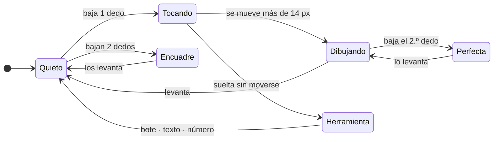
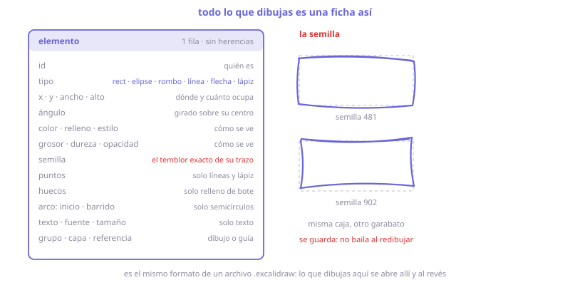
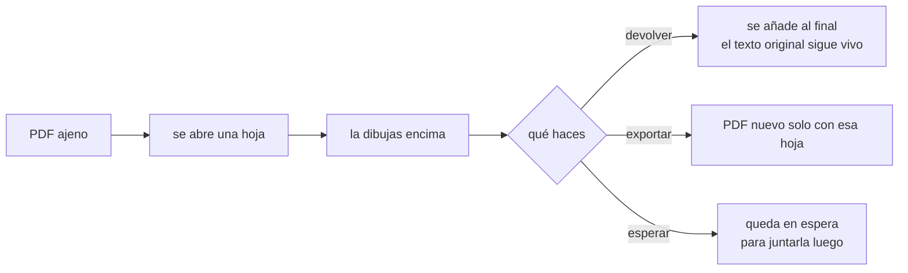
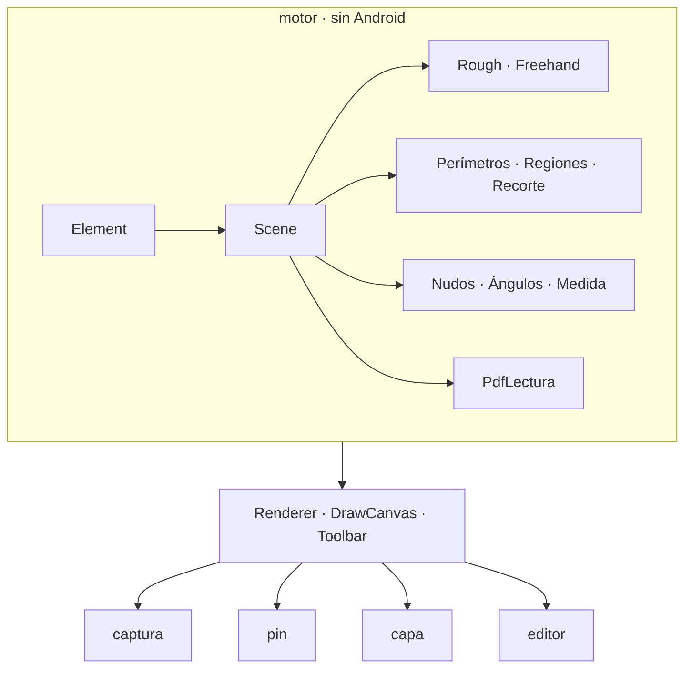

# PixPin de un vistazo

Catálogo visual. Cada lámina es una función.

| | |
|---|---|
| [Dónde se dibuja](#dónde-se-dibuja) · [Capturar](#capturar) · [Pines](#pines) | [Dibujar](#dibujar) · [Tapar](#tapar-y-señalar) · [Medir](#medir) · [Construir](#construir) |
| [Gestos](#gestos) · [Lápiz](#lápiz) · [Imán](#imán) · [Alfiler](#alfiler) · [Bote](#bote) | [Recortar](#recortar) · [El elemento](#el-elemento) · [Salidas](#salidas) · [PDF](#pdf) |
| [Ajustes](#ajustes) · [Dentro](#dentro) | |

---

## Dónde se dibuja


---

## Capturar


---

## Pines


---

## Dibujar


---

## Tapar y señalar


---

## Medir


---

## Construir


---

## Gestos




---

## Lápiz


---

## Imán


Prioridad: vértice → punto medio → cruce → centro → **borde** (solo si no hay nada más).

---

## Alfiler


| clavos | qué hace |
|:--:|---|
| 0 | se mueve libre |
| 1 | gira alrededor de él |
| 2+ | fija: solo se estira desde otro punto |

---

## Bote


---

## Recortar


---

## El elemento



---

## Salidas


---

## PDF




---

## Segundo dedo


---

## Ajustes


---

## Dentro



El núcleo no importa `android.*`. Se prueba en la JVM, sin emulador.

```
925 pruebas · todas en verde
```
